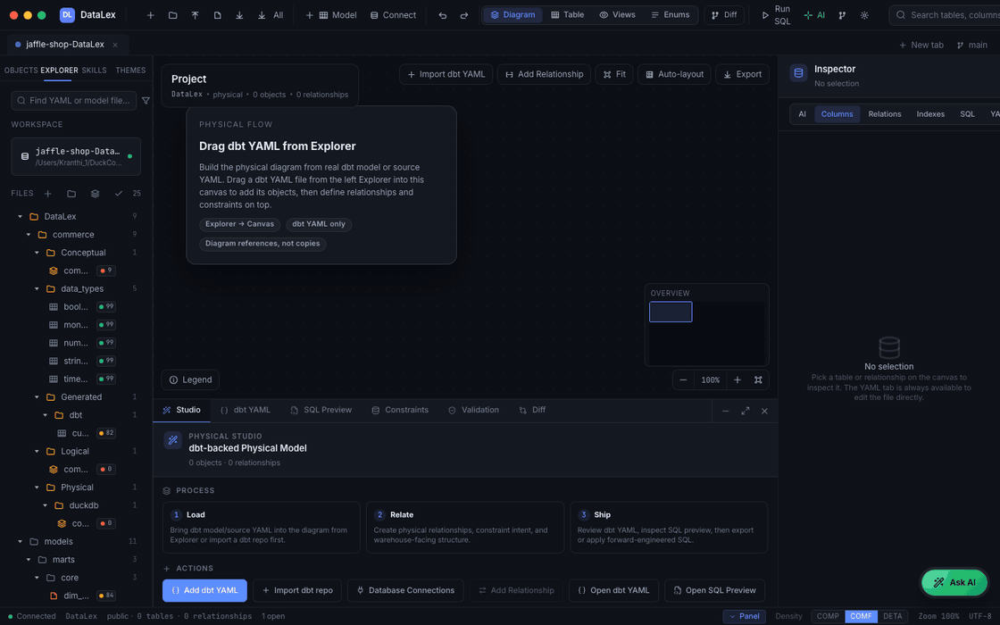
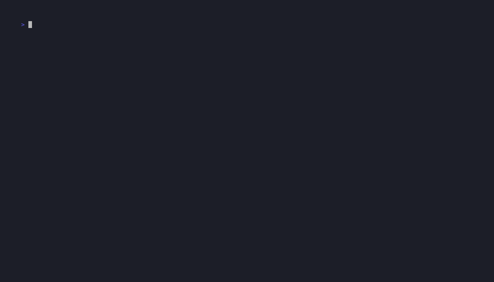

<div align="center">
  <a href="https://duckcode.ai/" target="_blank" rel="noopener noreferrer">
    
  </a>

# DataLex

**Git-native data modeling for dbt users.**

Point us at your dbt project and warehouse — we produce versioned, reviewable YAML
with contracts, lineage, ERDs, and clean round-trip back to dbt.

<p align="center">
  <a href="https://pypi.org/project/datalex-cli/">
    
  </a>
  <a href="https://github.com/duckcode-ai/DataLex/blob/main/LICENSE">
    
  </a>
  <a href="https://discord.gg/Dnm6bUvk">
    
  </a>
  <a href="https://github.com/duckcode-ai/DataLex/stargazers">
    
  </a>
</p>
</div>

<p align="center">
  
</p>

## Quickstart — two commands

```bash
pip install -U 'datalex-cli[serve]'    # CLI + bundled Node — one command, no prereqs
datalex serve                          # opens http://localhost:3030
```

That's it for most machines. No Docker, no database, and only one
terminal. The `[serve]` extra pulls a portable Node runtime. If you
already have Node 20+ on PATH, plain `pip install datalex-cli` works
too.

### When the app opens — the Onboarding Journey (1.4.1)

A **480px right-rail panel** slides in on first launch and walks you
through six concrete actions. Each step has a primary button that opens
the right dialog and **auto-advances** when the underlying event fires.
Progress is saved — close the panel anytime and resume where you left off.

| # | Step | What it does |
|---|---|---|
| 1 | **Welcome to DataLex** | Two-line value prop — click **Let's go** |
| 2 | **Connect your project** | Opens the Import dialog. Paste a Git URL (try `https://github.com/duckcode-ai/jaffle-shop-DataLex`) or pick a local dbt folder. **Edit in place** writes back to your real YAML. |
| 3 | **See what's missing** | Activates the Validation drawer; click any red file to view readiness gaps |
| 4 | **Design your first business domain** | `+` opens the New Logical Entity dialog (Customer, Order, …) |
| 5 | **Add your AI provider** | Opens Settings → AI; paste an OpenAI / Anthropic / local-LLM key |
| 6 | **Ask AI to draw a diagram** | One-click **Conceptualizer** proposes entities + relationships from your staging models |

Replay anytime via **Settings → Replay onboarding**. The deeper 13-step
spotlight tour is still there under **Settings → Deep feature tour**.

**Point it at your dbt repo:**

```bash
cd ~/my-dbt-project                    # folder containing dbt_project.yml
datalex serve --project-dir .
```

The folder auto-registers as your active project; the browser opens
straight into your real file tree. Every UI edit writes back to the
original `.yml` files — `git status` shows real diffs.

See **[docs/getting-started.md](docs/getting-started.md)** for the full
path matrix (demo → local dbt → git URL → live warehouse).

**Want your warehouse drivers too?**

```bash
pip install 'datalex-cli[serve,postgres]'        # or snowflake, bigquery, databricks…
pip install 'datalex-cli[serve,all]'             # every driver + Node
```

### Pick a tutorial

Once `datalex serve` is running, follow the path that matches what you
have in hand:

| You have...                                | Tutorial                                                           | Time  |
|--------------------------------------------|--------------------------------------------------------------------|-------|
| Nothing — want to try with a known-good dbt repo | [Walk through jaffle-shop end-to-end](docs/tutorials/jaffle-shop-walkthrough.md) | 5 min |
| An existing dbt project (folder or git)    | [Import an existing dbt project](docs/tutorials/import-existing-dbt.md)        | 5 min |
| A live warehouse (Snowflake/Postgres/…)    | [Pull a warehouse schema](docs/tutorials/warehouse-pull.md)                    | 7 min |
| CLI-only, no UI                            | [CLI dbt-sync tutorial](docs/tutorial-dbt-sync.md)                             | 5 min |

New here? Start with **[docs/getting-started.md](docs/getting-started.md)** —
it's the map across all four paths plus the mental model.

## 60-second demo (offline, no warehouse)

<p align="center">
  
</p>

```bash
pip install 'datalex-cli[duckdb]'
git clone https://github.com/duckcode-ai/DataLex.git
cd DataLex

# 1. Build a local DuckDB warehouse (no external credentials)
python examples/jaffle_shop_demo/setup.py

# 2. Sync the dbt project into DataLex YAML
datalex datalex dbt sync examples/jaffle_shop_demo \
    --out-root examples/jaffle_shop_demo/datalex-out

# 3. Emit dbt-parseable YAML back, with contracts enforced
datalex datalex dbt emit examples/jaffle_shop_demo/datalex-out \
    --out-dir examples/jaffle_shop_demo/dbt-out
```

Open `examples/jaffle_shop_demo/datalex-out/sources/jaffle_shop_raw.yaml` —
every column has its warehouse type, descriptions from the manifest, and a
`meta.datalex.dbt.unique_id` stamp so re-running the sync never clobbers
anything you've hand-authored.

## What it does

DataLex treats your data models as code. On top of a stricter YAML
substrate (the **DataLex** layout — one file per entity, `kind:`-dispatched,
streaming-safe for 10K+ entities), it gives you:

- **`datalex datalex dbt sync <project>`** — reads `target/manifest.json` + your
  `profiles.yml`, introspects live column types, and merges them into
  DataLex YAML. Idempotent: user-authored `description:`, `tags:`,
  `sensitivity:`, and `tests:` survive re-sync.
- **`datalex datalex dbt emit`** — writes `sources.yml` and `schema.yml` with
  `contract.enforced: true` and `data_type:` on every column. `dbt parse`
  succeeds out of the box.
- **`datalex datalex emit ddl --dialect ...`** — Postgres, Snowflake, BigQuery,
  Databricks, MySQL, SQL Server, Redshift. Same source, all dialects.
- **`datalex datalex diff`** — semantic diff with explicit rename tracking
  (`previous_name:`), breaking-change gate for CI.
- **`datalex datalex mesh check <repo> --strict`** — verifies dbt mesh
  Interface readiness for shared models declared with
  `meta.datalex.interface`. See [docs/mesh-interfaces.md](docs/mesh-interfaces.md).
- **Cross-repo package imports** — pin `acme/warehouse-core@1.4.0` in
  `imports:`, lockfile + content hash drift detection, Git-or-path
  resolution, on-disk parse cache for large projects.
- **Visual studio** — React Flow UI for editing entities, relationships,
  and metadata; same YAML files as the CLI.
- **Agentic modeling assistant** — local-first AI workflow for explaining
  selected objects, reverse-engineering dbt repos into conceptual/logical
  views, proposing focused YAML patches, and applying approved changes
  through the same guarded save APIs as manual edits. Context comes from
  structured dbt/DataLex facts, manifest/catalog metadata, BM25 lexical
  search, validation output, project memory, and team skills under
  `DataLex/Skills/*.md`; no vector search is used for code/YAML retrieval.

## Supported warehouses

| Warehouse | `dbt sync` introspection | Forward DDL | Reverse engineering |
|---|:---:|:---:|:---:|
| DuckDB | ✓ | — | — |
| PostgreSQL | ✓ | ✓ | ✓ |
| Snowflake | (fallback) | ✓ | ✓ |
| BigQuery | (fallback) | ✓ | ✓ |
| Databricks | (fallback) | ✓ | ✓ |
| MySQL | (fallback) | ✓ | ✓ |
| SQL Server / Azure SQL | (fallback) | ✓ | ✓ |
| Redshift | (fallback) | ✓ | ✓ |

"Fallback" = uses the existing full-schema connector (slower than the
per-table path but already works today; a narrow introspection path ships
per-dialect over time).

## Install

Use the path that matches what you are trying to do:

| Goal | Recommended path |
|---|---|
| Try DataLex or use it with your dbt repo | [PyPI install](#pypi-install-recommended) |
| Develop DataLex itself from this repo | [Source checkout](#source-checkout-for-contributors) |
| Avoid local Python/Node setup differences | [Docker fallback](#docker-fallback-optional) |

### PyPI Install (Recommended)

From [PyPI](https://pypi.org/project/datalex-cli/):

```bash
pip install -U 'datalex-cli[serve]'                 # CLI + UI (recommended)
pip install -U 'datalex-cli[serve,postgres]'        # add a warehouse driver
pip install -U 'datalex-cli[serve,all]'             # every driver + UI
pip install -U datalex-cli                          # CLI-only, no UI
```

Available extras: `serve`, `duckdb`, `postgres`, `mysql`, `snowflake`,
`bigquery`, `databricks`, `sqlserver`, `redshift`, `all`.

**Prereqs:** Python 3.9+ and Git. Node 20+ is optional because
`[serve]` bundles a portable Node runtime.

Verify the installed package:

```bash
datalex --version
```

Configure AI providers in **Settings → AI**. DataLex supports local
fallback responses plus OpenAI, Anthropic, Gemini, and Ollama-compatible
endpoints. Provider keys are stored locally in the browser; generated YAML
is never written until you approve an explicit proposal.

For the local DuckDB-based example repo, install the matching driver too:

```bash
pip install -U 'datalex-cli[serve,duckdb]'
```

### Source Checkout For Contributors

```bash
git clone https://github.com/duckcode-ai/DataLex.git
cd DataLex
python3 -m venv .venv && source .venv/bin/activate
pip install -e '.[serve,duckdb]'
npm --prefix packages/api-server install
npm --prefix packages/web-app install
datalex serve                                    # auto-builds the UI on first run
```

Source checkouts need Node 20+ with `npm`. If you skip the npm install
commands, `datalex serve` will try to install missing API/web
dependencies on first run.

### Docker Fallback (Optional)

Docker is useful when you want to avoid local Python/Node version drift
or when a company laptop blocks global installs. It is not required for
normal use.

```bash
git clone https://github.com/duckcode-ai/DataLex.git
cd DataLex
docker build -t datalex:local .
docker run --rm -p 3030:3001 datalex:local
```

Open `http://localhost:3030`.

To run DataLex against an existing dbt repo from Docker, mount that repo
and point `REPO_ROOT` at the mounted path:

```bash
cd ~/path/to/your-dbt-project
docker run --rm -p 3030:3001 \
  -v "$PWD":/workspace \
  -e REPO_ROOT=/workspace \
  -e DM_CLI=/app/datalex \
  datalex:local
```

In the UI, use `/workspace` as the dbt repository path.

### Install Troubleshooting

If `datalex serve` fails with:

```text
ERR_MODULE_NOT_FOUND ... datalex_core/_server/ai/providerMeta.js
```

you are using a wheel that did not include the full API server runtime.
Upgrade to `datalex-cli` 1.3.4 or newer:

```bash
pip install -U 'datalex-cli[serve]'
```

Until that patch is available in your package index, install from the
current source checkout:

```bash
git clone https://github.com/duckcode-ai/DataLex.git
cd DataLex
python3 -m venv .venv && source .venv/bin/activate
pip install -e '.[serve,duckdb]'
datalex serve
```

## Project layout

```text
DataLex/
  packages/
    core_engine/           # Python: loader, dialects, dbt integration, packages
      src/datalex_core/
        _schemas/datalex/  # JSON Schema per `kind:` — bundled with the package
    cli/                   # `datalex` entry point
    api-server/            # Node.js API (UI backend)
    web-app/               # React Flow studio
  examples/
    jaffle_shop_demo/      # zero-setup dbt-sync demo (DuckDB)
  model-examples/          # sample projects and scenario walkthroughs
  docs/                    # architecture, specs, runbooks
  tests/                   # unittest suite (core engine + datalex)
```

## Visual Studio

`datalex serve` ships the full UI — no extra setup. If you're hacking
on the web app itself and want hot-reload, run the two dev servers from
a source checkout:

```bash
# Terminal 1 — api (port 3030)
npm --prefix packages/api-server run dev
# Terminal 2 — web (port 5173)
npm --prefix packages/web-app run dev
```

The UI reads and writes the same YAML files the CLI does — no database,
no hosted service.

## CI / GitOps

DataLex is designed to live in your repo next to your dbt project.
A typical CI step:

```bash
./datalex datalex validate datalex/
./datalex datalex diff datalex-main/ datalex/ --exit-on-breaking
./datalex datalex dbt emit datalex/ --out-dir dbt/
dbt parse
```

## Documentation

**Onboarding**

- **[Getting started](docs/getting-started.md)** — the one-page map
  covering install, the three GUI paths, and the mental model.
- **[Jaffle-shop walkthrough](docs/tutorials/jaffle-shop-walkthrough.md)** —
  end-to-end demo: clone the DataLex-ready jaffle-shop repo, build it
  with DuckDB, review conceptual/logical/physical diagrams, and commit
  normal dbt/DataLex YAML diffs.
- **[Import an existing dbt project](docs/tutorials/import-existing-dbt.md)** —
  5-minute bring-your-own-repo flow (local folder or git URL).
- **[Pull a warehouse schema](docs/tutorials/warehouse-pull.md)** —
  7-minute live-connection flow with inferred PKs/FKs and streaming
  progress.
- **[Agentic AI modeling](docs/ai-agentic-modeling.md)** — how Ask AI,
  skills, memory, search/indexing, proposal review, and auto-refresh work.
- **[CLI dbt-sync tutorial](docs/tutorial-dbt-sync.md)** — original
  CLI-only jaffle_shop walkthrough.

**Reference**

- **[DataLex layout reference](docs/datalex-layout.md)** — what each
  `kind:` file looks like and how the loader discovers them.
- **[CLI cheat sheet](docs/cli.md)** — every `datalex datalex …` subcommand on
  one page.
- **[API contracts](docs/api-contracts.md)** — HTTP API reference for
  integrators.
- **[Architecture](docs/architecture.md)** — core engine modules and
  end-to-end data flow.
- Pre-DataLex specs have moved to [docs/archive/](docs/archive/).

## Community

- Discord: [](https://discord.gg/Dnm6bUvk)
- Issues: [](https://github.com/duckcode-ai/DataLex/issues)
- Contributing: `CONTRIBUTING.md`
- License: [](LICENSE)
