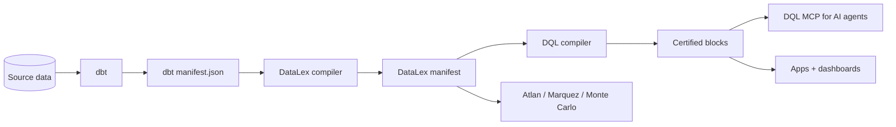

---
hide:
  - navigation
  - toc
---

# DataLex

> **YAML-first data modeling that makes contracts machine-checkable for the AI era.**

In 2026, AI agents answer the same business question different ways and return different numbers. CFOs and data leaders are starting to ask "can we trust the AI numbers?" — and right now the answer is "no."

DataLex is the layer that turns that "no" into "yes" — by giving your dbt project a governed conceptual model and machine-enforceable contracts that AI tools can't bypass.

---

## Why DataLex

- **Sits above dbt, never replaces it.** Reads `target/manifest.json`, never writes back without a reviewable diff. Your dbt project stays the source of truth for transformations.
- **Conceptual, logical, and physical layers stay connected.** Business meaning, data structure, and dbt implementation share one YAML graph instead of drifting across SQL, tickets, and tribal knowledge.
- **Reviewable AI authoring.** `datalex draft` proposes contracts from a dbt project; you accept, edit, and commit. No silent rewrites of project files.
- **Compile-time contract checks.** When a [DQL block](datalex-and-dql.md) references a contract by id, the DQL compiler resolves it against your DataLex manifest and refuses to ship if the binding breaks.
- **Open source forever.** Apache 2.0. No closed-source language features.

---

## Install

=== "pip"

    ```bash
    pip install datalex-cli
    ```

=== "AI drafting (optional)"

    ```bash
    pip install datalex-cli[draft]
    export ANTHROPIC_API_KEY=sk-ant-...
    ```

=== "Run web UI"

    ```bash
    pip install datalex-cli[serve]
    datalex serve
    ```

---

## Five-minute path

1. **[End-to-end DataLex + DQL tutorial](tutorials/datalex-plus-dql-end-to-end.md)** — feel the wedge in 5 minutes using both example repos. The fastest way to understand the product.
2. **[Get started](getting-started.md)** — install, scaffold a project, compile your first model.
3. **[Walk through Jaffle Shop](tutorials/jaffle-shop-walkthrough.md)** — full dbt + DuckDB + DataLex example.
4. **[Layered modeling](datalex-layout.md)** — when to use conceptual vs. logical vs. physical.
5. **[The DataLex + DQL stack](datalex-and-dql.md)** — how the two languages combine for certified AI analytics.

---

## Architecture in one diagram



DataLex is the green-field substrate above dbt. DQL consumes the manifest below dbt. Both speak the [public manifest spec](https://github.com/duckcode-ai/manifest-spec).

---

## Open source

DataLex is Apache 2.0 and built in the open at [`duckcode-ai/DataLex`](https://github.com/duckcode-ai/DataLex). File issues, send PRs, drop into [Discord](https://discord.gg/Dnm6bUvk).

For the broader plan — manifest-spec versioning, the DQL companion, the launch checklist — see [`ROADMAP.md`](https://github.com/duckcode-ai/DataLex/blob/main/ROADMAP.md).
